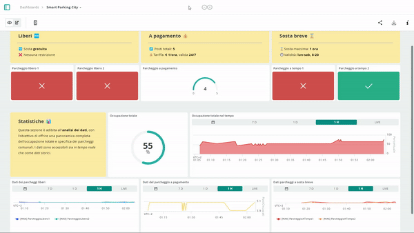

# Smart Parking City 🚗

Prototype of a smart parking system implemented at the municipal level, designed to show how the introduction of **IoT devices** (*Internet of Things*) can facilitate people's lives.

-----------------------------------------------------------------------------------------------------------
-----------------------------------------------------------------------------------------------------------

## Index
1. [The world of IoT 🌐](#the-world-of-iot-globe_with_meridians)
2. [Project overview 🚗](#project-overview-red_car)
3. [Materials 🛠️](#materials-hammer_and_wrench)
4. [Circuit 🔌](#circuit-electric_plug)
5. [Code 👨‍💻](#code-man_technologist)
6. [Interdisciplinary connections 🔗](#interdisciplinary-connections-link)
7. [Conclusions on the experience 💭](#conclusions-on-the-experience-thought_balloon)
   
-----------------------------------------------------------------------------------------------------------
-----------------------------------------------------------------------------------------------------------

# The world of IoT :globe_with_meridians:

Before diving into the project itself, it's worth introducing the concept of the "*Internet of Things*".
## An interconnected world
The world is witnessing a rapid expansion of digital networks, enabling devices to connect and share information. This phenomenon, known as ***digital transformation***, involves applying digital technology to foster innovation and progress.
**Sensors** are now everywhere: they allow the collection of vast amounts of data, which can be stored, analyzed, and used for a variety of purposes, such as monitoring the environment, predicting population growth, managing waste, enhancing home security, and much more.

**Fun Fact** 💡: The proliferation of affordable processors and wireless networks has facilitated the spread of IoT devices. It is predicted that by 2025, there will be 38.6 billion devices connected to the Internet, increasing to 50 billion by 2030, with an average of 190 million new devices every month.

## Internet of Things
### What is IoT?
> **“*Internet of Things*” (IoT) is an interconnected network of physical devices (*things*) that communicate and exchange data to improve efficiency and human experience in various sectors, using sensors, actuators, and other technologies.**

## What characteristics should an IoT device have?
- **Connectivity:** The ability to reliably connect to networks using effective communication technologies and protocols.
- **Sensors and Actuators:** The ability to sense the environment through sensors and act on it via actuators; this functionality allows the device to collect data, make decisions based on that data, and potentially influence the surrounding environment.
- **Automation:** The implementation of self-managed processes that reduce and eventually eliminate the need for human intervention; IoT opens a new world where activities that previously required human involvement can become automated.
- **Scalability:** As IoT environments can vary greatly in size and complexity, devices should be designed to scale easily, allowing them to be used in small home networks or large industrial networks.
- **Security:** Data integrity and security are crucial in the IoT realm, especially when dealing with sensitive information or critical devices.
- **Interoperability:** The ability to interact with other devices and systems, essential for effective communication between devices from different manufacturers and platforms.
- **Energy Efficiency:** Many IoT devices are powered by batteries or limited energy sources; energy efficiency is key to ensuring long battery life and reducing environmental impact.
- **Remote Maintenance and Updates:** Essential to ensure that IoT devices remain secure and up-to-date over time.

## How do IoT devices connect to the network?
A **sensor** must be connected to a network so that the collected data can be stored and shared.
The **controller** is responsible for gathering data from sensors and ensuring connectivity: it can either make immediate decisions or send data to a more powerful computer for analysis.
These elements typically work together with a device called an **actuator**. Actuators receive electrical input and convert it into physical action.

## Pros and cons
The IoT offers numerous **advantages**, enabling the efficient collection and analysis of data from sensors. Companies benefit from detailed insights into their products and customers, optimizing production and targeting marketing effectively. Cities manage traffic, recycling, healthcare, and transportation needs. Individuals benefit in terms of health, home security, and reduced energy costs.

At the same time, it’s important to consider the **disadvantages**: companies developing wearable devices have access to users' personal information; reliance solely on online purchases could lead to job losses; retailers know all the purchases made; a network disruption can have catastrophic consequences.

-----------------------------------------------------------------------------------------------------------
-----------------------------------------------------------------------------------------------------------

# Project overview :red_car:

## Briefly...

The project involves developing a prototype of a **smart parking system** implemented at the municipal level. It consists of a scaled model of a municipal road with **three different types of parking spaces**, each demonstrating a potential IoT application to facilitate management. Data collected by sensors is transmitted to a network application, allowing real-time monitoring of parking occupancy and storing historical data for analysis and future predictions.

-----------------------------------------------------------------------------------------------------------

-----------------------------------------------------------------------------------------------------------

-----------------------------------------------------------------------------------------------------------

-----------------------------------------------------------------------------------------------------------

-----------------------------------------------------------------------------------------------------------

-----------------------------------------------------------------------------------------------------------

## Purpose

The project aims to demonstrate how the introduction of IoT devices can significantly improve the **quality of life** by focusing on urban parking contexts.

Integrating these technologies offers several practical advantages, including receiving **real-time updates** on parking space availability, thereby reducing the time and stress associated with finding parking. Moreover, using sensors and prediction algorithms enables **accurate estimates** of future parking availability, helping drivers better plan their trips. These innovations can reduce traffic congestion caused by parking search, enhance urban transport efficiency, and contribute to a more sustainable environment by reducing CO2 emissions. The data collected can also assist municipal administrations in optimizing urban space management by identifying areas with high parking demand and planning targeted infrastructure interventions. Another advantage is the ability to integrate automated payment systems, allowing users to reserve and pay for parking via an app, making the process quicker and more convenient.

In summary, the project not only aims to demonstrate the effectiveness of IoT devices in improving parking management but also highlights how these technologies can contribute to creating smarter and more livable cities, enhancing citizens' quality of life through innovative and sustainable solutions.

## Prototype

The prototype features **three types of parking spaces**, each with unique characteristics and functionalities.

### **FREE PARKING**

The project includes two free parking spaces with indefinite free parking. Each is equipped with an *ultrasonic sensor* and an *LED indicator* that shows its **status**. When the sensor detects an obstruction for a certain period, the parking space is marked as occupied (LED on). Conversely, if no obstruction is detected for a certain period, the space is indicated as vacant (LED off).

### **TIMED PARKING**

The project also includes two timed parking spaces for short-term parking. In addition to the functionalities of free parking spaces, these spaces have a **maximum occupancy limit**, valid only from Monday to Saturday between 8:00 AM and 8:00 PM. During this interval, if the limit is exceeded (with a certain tolerance), the LED indicator of the slot will begin **flashing** (in a real scenario, automatic notification could be implemented). Outside of these hours, the parking space is free.

**Fun fact** 💡: The flashing LED, a clear and visible signal to all, aims to promote **parking rules compliance**, as people naturally tend to avoid behaviors that might cast them in a negative light. There exists a psychological principle where people adjust their behavior when aware of being observed or when undesired actions are made visible to all.

### **PAID PARKING**

The paid parking consists of 5 parking spaces, accessible via a one-way alternating traffic system. It features an access barrier (controlled by a *servo motor*), two *infrared sensors* to detect vehicles, two *LED indicators* functioning as traffic lights, a *photoresistor*, and three additional *LED indicators* for managing automatic lighting. The parking cover includes dummy photovoltaic panels, which in a real context could provide renewable energy to power parking devices.

#### Access regulation

Entries and exits from the parking lot are monitored by sensors that constantly update the **vehicle count**. A green light signals available parking spaces, allowing entry, while red indicates all spaces are occupied and entry is temporarily denied.

**Entry to the parking lot**:
- The user approaches the sensor at the entrance.
- If spaces are not all occupied (green light), after a brief detection period, the user retrieves a ticket for payment.
- The barrier opens, closing only when the sensor beyond the barrier is activated and then deactivated, indicating the vehicle has completely passed through.
- Only at this point will the parking counter be incremented by one.

**Exit from the parking lot**:
- The user approaches the sensor at the exit.
- After a brief detection period, the user returns the paid ticket.
- The barrier opens, closing only when the sensor beyond the barrier is activated and then deactivated, indicating the vehicle has completely passed through.
- Only at this point will the parking counter be decremented by one.

#### Automatic lighting

The parking lot features an automatic lighting system activated by a **photoresistor**. This sensor detects when the brightness level falls below a preset threshold for a given time interval, thereby activating the three white LEDs used for parking lot illumination.

## Parameter adaptation

For practicality, adjustments have been made to certain parameters, with values **differing from real-world settings**. Below is a summary table.

| Parameter | Real value | Demonstrative value | Description |
| --- | --- | --- | --- |
| Detection time | 30 seconds | 3 seconds | Time required for a sensor to detect a vehicle, to prevent errors caused by momentary interference. |
| Detection distance | 2.5 meters | 5 cm | Threshold distance within which a vehicle is detected in a parking space. |
| Maximum time in timed zone | 1 hour (+ 15 minutes tolerance) | 16 seconds (+ 4 seconds tolerance) | Maximum time for occupying a timed parking space, with a 25% tolerance. |
| Brightness stabilization Time | 20 seconds | 2 seconds | Time required before twilight lights turn on or off, to prevent flickering when brightness is near the threshold.

#### Notes
- Separate exit was not provided due to the relatively small parking area and its non-necessity for project demonstration purposes. Alternatively, a function preventing entry and exit (by turning on the red light) when both sensors are activated, indicating two vehicles approaching simultaneously from opposite directions, was introduced.
- The payment system was not included as it was irrelevant for project demonstration purposes but would be essential in a real-world implementation.

## Application

*The interface is available in both "desktop" (horizontal) and mobile (vertical) versions.*

The project also includes an **application** (hosted on *Arduino IoT Cloud*) that allows checking the **real-time status** of parking spaces, analyzing **historical data** on parking occupancy, and providing information on hourly distribution of slot occupancy. This can offer various advantages such as facilitating parking search, estimating future availability, reducing traffic congestion, contributing to a sustainable environment, and optimizing urban management...

Indicators display the status of individual parking spaces, while graphs facilitate analysis of collected data. For more detailed and extended periods of investigation, downloading a **CSV file** containing a summary of all historical data allows further analysis using specialized software such as Excel.

*App in action*.

-----------------------------------------------------------------------------------------------------------
-----------------------------------------------------------------------------------------------------------

# Materials :hammer_and_wrench:

## Model
- Cardboard box with lid: 62.0 x 44.0 cm x 10.0 cm
- Silver cardboard box: 34.0 cm x 18.5 cm x 13.0 cm
- Adhesive tape (transparent and colored) and double-sided tape
- Corrugated cardboard
- Cardstock
- 3 small wooden sticks
- 4 toothpicks
- Gray modeling clay
- Popsicle stick

## Map

*(created using CorelDRAW Essentials 2021 software)*

The map illustrates a road path featuring **3 distinct types of parking**, each with its own characteristics and for demonstrative purposes.

**N.B.:** Please note that the map is designed solely for **theoretical and conceptual** purposes, hence some of its features may not be practically applicable in a real-world street scenario.

## Circuit Components
The table below lists the different components used in the circuit. For complete technical specifications, refer to their respective *datasheets*.

| Component | Quantity | Description |
| --- | --- | --- |
| [`Arduino UNO R4 WiFi`](https://docs.arduino.cc/hardware/uno-r4-wifi/) | 1 | **Arduino** is an open-source hardware and software platform used to create digital devices capable of interacting with the outside world through sensors and actuators ([datasheet](https://docs.arduino.cc/resources/datasheets/ABX00087-datasheet.pdf)). |
| [`Breadboard`](https://www.amazon.it/AZDelivery-Breadboard-830-Arduino-Raspberry/dp/B07K8PQ4B5/ref=sr_1_2_sspa?crid=1LMAFIJE2TP5X&dib=eyJ2IjoiMSJ9.xi5AD3br6MkhFSnelneIz7280DzKo1UPIgHXXQxS0vDi-8Bj8_KMO0Ft7mOEqn_c4DgwRgptPgED-dbL794yeQGaXmW2_qVZUJwOZC9koeBdMlCEWO5zqT9bsy9L2nphxe2txNQFNUz6pkFSZn8p07Ap2cJVg1HmHG6fYz52zx-99Eig9D_CrKX9PWKCvcmJHxeDd1Yq5woqp8RimPIKu8p5l6XgSiEbDgoBknKcrwAFMY1qN1KmEPWghXLIkrgJr-bDWcngQiwzBPV1lfq6UnJalqQV_hPRmeFzyHoQ3pc.CoHS3PYbmqBx3LB_7yP7nYr01mM75NqVi_AmuokDvlI&dib_tag=se&keywords=breadboard%2Bazdelivery&qid=1711213155&sprefix=breadboard%2Baz%2Caps%2C111&sr=8-2-spons&sp_csd=d2lkZ2V0TmFtZT1zcF9hdGY&th=1) | 1 | A breadboard is a solderless construction base used to build **semipermanent** prototypes of electronic circuits. |
| [`HC-SR04 ultrasonic sensors`](https://www.amazon.it/HC-SR04-Misuratore-Distanze-Ultrasuoni-Ultrasonic/dp/B01COSN7O6/ref=sr_1_1_sspa?__mk_it_IT=%C3%85M%C3%85%C5%BD%C3%95%C3%91&crid=30NWWH1A2DL14&dib=eyJ2IjoiMSJ9.YPGfdw-5BDSrtfbP8kv-6aGGle4kgcSXSrlzpcqGoPsfcnfizPwGRtIYfIKsq8itrG6JeKxwGq2DwFn2DMf3zIOc5y_8k_RRBCZPZdmaIo9Gq8HodidfIYzK55jsxE15lHQb5P9RAw47zHFb6QvEz25AzeJv8u7KZ16vRqjMBMAjXJQQq62uieufO6f0KGgoCKjZyjgB0C6J_I2DyW6kR0wi-I-azZVeTOnXJJl8Rr1pkvhKk88J7EMqu6S0r-TB6uziPzrA0N30beduj5U6ryeTwGEe2sOSwjErChZhAa0.2y-gnTMdJfhvV7wX6Yj0LG5YkOOeMEmsXL6mW3etajA&dib_tag=se&keywords=hc-sr04&qid=1710178436&sprefix=hc-sr04%2Caps%2C119&sr=8-1-spons&sp_csd=d2lkZ2V0TmFtZT1zcF9hdGY&psc=1) | 4 | An ultrasonic sensor is a device that measures the distance to an object by emitting **ultrasonic** waves and converting the reflected sound into an electrical signal. <ul><li>Power Supply: 5V DC</li><li>Range: 2 cm - 300 cm</li><li>Effective Angle: <15°</li></ul> |
| [`Infrared sensors`](https://www.amazon.it/AZDelivery-ultrasuoni-distanza-Raspberry-Abstandsensor/dp/B07D924JHT/ref=mp_s_a_1_5?dib=eyJ2IjoiMSJ9.N_u-ND_UNSKzILwTb_kxjlsZcEJNcU5Le3Hu39DGXwD1VZKRyrOdLBsll-pX1661BkCRVFys71-XLrlVqggrRjAohvOBZQRBgTgw6dQHC427BW-roSgnvJVozBauLSVE2-UaNJdcLvi581S5n_ZWF1OW3G5-9n3PBW2uPtV2ShYr_AD1vIiHsBmQy3Bxs5FrI4oLC_FK1V0thHQPpEed7A.yO1UcKvXtKMLtSVnJ6Q17CHAcejGBa83jLJXz3p3RHQ&dib_tag=se&keywords=Arduino%2BIr%2BSensor&qid=1710180504&sr=8-5&th=1) | 2 | An infrared (IR) sensor is a device that measures and detects infrared radiation in the surrounding environment, often used as a **proximity** detector. <ul><li>Power Supply: 5V DC</li><li>Range: 2 cm - 30 cm</li><li>Effective Angle: <35°</li></ul> |
| [`LED`](https://www.amazon.it/AZDelivery-Emissione-Circolare-Emettitore-compatibile/dp/B08T1YGM8K/ref=sr_1_8?__mk_it_IT=%C3%85M%C3%85%C5%BD%C3%95%C3%91&crid=2G25R9Q9KMV7M&dib=eyJ2IjoiMSJ9.Am2uI2a0USpWEEaWXZ90u194WS8WKSs1QZNDmJ6hj8_hYjaYFnkLlHD6lVWbkPfdHygL7TaWlO8mNwOuxr-frFUB0bavzQ94Ibj_YaqSa1V1ME1AiB6mrNFXCaHSsiUCMdFt-A4Ifhh9wUiVrrhQ3m4ttITdREQZFpaWtH6MWmbqbfQq1p714WPJp3kfOx224M1b20MTaLoXEOwoxqgkREE7-gup46SCvOQlz043GhnGBglaU4R-J4IT82WMzcNHRLVTaOKyj0LCsq0WJIhUfid-j2uI-_CjezbgR3MpGww.0WSwAdpsbW0cjDMWK-UAEMssRI6VXRBNlLM9M9BpgCs&dib_tag=se&keywords=led+arduino&qid=1711231790&sprefix=ledsarduino%2Caps%2C106&sr=8-8) | 9 | A LED (*Light Emitting Diode*) is a semiconductor device that emits **light** when current flows through it. <ul><li>(4x) Blue LEDs (*Vf* = 2.7 V; *If* = 20 mA)</li><li>(3x) White LEDs (*Vf* = 2.7 V; *If* = 20 mA)</li><li>(1x) Green LED (*Vf* = 2.5 V; *If* = 20 mA)</li><li>(1x) Red LED (*Vf* = 1.9 V; *If* = 20 mA)</li></ul> |
| [`Resistors`](https://www.amazon.it/AZDelivery-Resistenze-Resistori-Arduino-gratuito/dp/B07Q87JZ9G/ref=mp_s_a_1_3?crid=2TC9BVKNFDZ8E&dib=eyJ2IjoiMSJ9.m5BpWsNponXDu2NgiZft18byMuQH5acGxvlPhkBDKIAP6-y2xkoGZDoyxxVfIyDYEAg99g_jaLYLPw8QVpi4V4XCuJx9dncmhRd_uYIwo9uobWLQXDFQJ4iGopYZX5K_RucRwQR4Q-SBcYHL1jgJWOIpFCjRGIo-STIrgjKXDrMMtJ_gDsPfRLhde17dlA3fmogNdJBKoq52tJmEmCQ0lA.9eHZDTs0PXLqoFtuXdFetqe9rQbFbAhfiUGoJ44W2ts&dib_tag=se&keywords=azdelivery+resistor&qid=1711229207&sprefix=azdelivery+resistor+%2Caps%2C168&sr=8-3) | 10 | A resistor is an electronic component that limits the flow of current in a circuit, determined by its resistance value measured in ohms, essential for **controlling** the amount of current through the circuit and protecting sensitive components. <ul><li>(9x) 470 Ω Resistors, 1/4 W</li><li>(1x) 10 kΩ Resistor, 1/4 W</li></ul> |
| [`Photoresistor`](https://www.amazon.it/AZDelivery-fotoresistenti-LDR5528-compatibili-Arduino/dp/B089YNCYG4/ref=sr_1_7?__mk_it_IT=%C3%85M%C3%85%C5%BD%C3%95%C3%91&crid=2A3APBD8O8PY&dib=eyJ2IjoiMSJ9.QA9xJKurHImIT1lWJXxxdlnbVU5UKDHiJiSE8BfTa5shSX8N_5-MaEax9oqEEga5oNdL8Azt-5rqM3ElFDL3_B0r6F1qAQhCQTbHtBPYBOur-ZnERjDBQYsBogf_XU816SJLQFBg719l7WRvUNZGG7LiAoieR9oRcJriKK3CDxooxr4I4-moYNi1UXT8sbimDNixjAUhLv2dQ-H4lnygvw2ixt41P2KxyN8yO6ETdJ9fLiwU0NgUWKRUQkIr3XEbgrfC6cIpOYQ1T80aCICCmrM0zGWEunkuGV8vYIbvqds.Z_CgHc8fCiFFLbCQ0lHBB4iV51wunor6gzONEHCuHQs&dib_tag=se&keywords=photoresistor%2Bldr&qid=1711311437&sprefix=photoresistor%2Bld%2Caps%2C114&sr=8-7&th=1) | 1 | A photoresistor is an electronic component whose resistance is inversely proportional to the amount of light that hits it, making it suitable for creating **twilight lights**.|
| [`SG90 servo motor`](https://www.amazon.it/AZDelivery-Servomotore-compatibile-Elicottero-Arduino/dp/B07CYZK379/ref=sr_1_3_sspa?dib=eyJ2IjoiMSJ9.H5GMwpa4wNe8ulI-HmmzdcDht2QFTc48OwjhYYXIGgnF_nrgGONIOFU5ZTkcfWKfsql0zVMRrjnDoI1RDVFKbSKTAc8BVYbfDwlvx7gUBatWIHzP4UajWxboJIyJEdFu6NJDMSqDGAm6o207fv4AhQjXq59-yz3EZihzw5uH_0ZfiRZKMJWrpRNE2Z6cYtxTJxzI5ZC9MJeLHkQZb6y57rli0luWh3UFG2-qbtL_fFc-jzGfIWlapPriDetNoK6c0iaOqV0gYQqzO__K9Kn788wdh8yWWhfTVFtSnvadwKg.lN3SZuhmgmwKlqWWHE71rGuFKolFMLjj86eRxRc3MsI&dib_tag=se&keywords=arduino%2Bservo%2Bmotor&qid=1710865115&sr=8-3-spons&sp_csd=d2lkZ2V0TmFtZT1zcF9hdGY&th=1) | 1 | A servo motor is a device that converts a control signal into **precise and controlled** motion, commonly used for position control in robotic systems and industrial automation. <ul><li>Power Supply: 4.8 - 6 V DC</li><li>Rotation Angle: 180°</li><li>Speed: 0.1 s per 60°</li><li>Torque: 2.5 kg/cm</li></ul> |
| [`Jumper wires`](https://www.amazon.it/gp/aw/d/B07KCFG5YX/?_encoding=UTF8&pd_rd_plhdr=t&aaxitk=de9838076b80169474b4678f431464e9&hsa_cr_id=3263644680502&qid=1711312198&sr=1-1-e0fa1fdd-d857-4087-adda-5bd576b25987&ref_=sbx_be_s_sparkle_lsi4d_asin_0_title&pd_rd_w=rpZDT&content-id=amzn1.sym.b580b30c-dd62-441e-ab95-5e749dbe7889%3Aamzn1.sym.b580b30c-dd62-441e-ab95-5e749dbe7889&pf_rd_p=b580b30c-dd62-441e-ab95-5e749dbe7889&pf_rd_r=JVVYGQ2GXAEZ3D0TW82Y&pd_rd_wg=FwLuU&pd_rd_r=161e4473-fa7a-4822-8c9c-0136839bec18&th=1) | ~200 | Jumper wires are **short and flexible** electrical cables used to quickly connect electronic components together without soldering. They come in *male-to-male*, *male-to-female*, and *female-to-female* variants based on their end types. |
| [`Powerbank 5V`](https://www.amazon.it/Powerbank-10400mAh-Caricabatterie-Portatile-Smartphone/dp/B07K1D2T5Z/ref=sr_1_5?__mk_it_IT=%C3%85M%C3%85%C5%BD%C3%95%C3%91&dib=eyJ2IjoiMSJ9.BIPnA8BKQhI8x_Uw5NNC-ug9yp0vTNsgVnbbs540ql1PzfFz5pwgr0mGNSesYeJonzmXacp1TX9ZhE54HvZrd02JtxGU_I9_gg2Qh0CFwFtPZcHX8Y-x8moMi_ZY8JzwNdqkyksxVemAAdcSNruSDtnZnticvLbntWML0MupUhjskF9LliKCn8-lI9b5xmm-aM1YmUO5QdJBMt2eY57vMuqlD9gqqqhOY_xsK5dqe8PoOnjdU8szz8SnYLFUxn9mbz4nRnuMUTmGxes365E4yqdYn0ZI_vLXLLmywo92t_M.7kuAkz54nGoahHmgf3QfydIKKFDvwwCP2OTcN0c8bns&dib_tag=se&keywords=power+bank+5+volt&qid=1713165582&sr=8-5) | 1 | A power bank is a **portable** energy source designed to power **USB** devices, providing energy through rechargeable internal batteries. <ul><li>Voltage: 5 V</li><li>Current (max): 3 A</li><li>Capacity: 10400 mAh</li></ul> |
| [`AA batteries`](https://www.amazon.it/GP-Batterie-alcaline-extra-Pack/dp/B07QLY7GJM/ref=sr_1_51?adgrpid=52877419152&dib=eyJ2IjoiMSJ9.7qd2mWgPWlRveGEJRbjXJNr_1e9RKYC6IRoJ2DMJVN8DdBdwJqCzqK73YUGTu7Fp6M8yQAk3qMl9dYuvGwGbMX7USwwgVBXJGIIQ5_AyID0oKvImWeARVVw5WJEQ0Yu4qGTWo3c7yk3QvBtwPNUi0jkd5V4RcMvFwj5okyh7y0IhIXa5eOPrGXhx_wAhMs2IetHvDGn6JOylqSXNwCbYjeA4Rl0DjkUd5rvQNbVtBsfFoNIqIcWG39teBqrWrV3nV3eMhC6yga41q2zkZMfY9eRJsmqzn6z_76V3YKGhaRc.uM6QNZjC_zp7i0GUddvcEFiaSM3V_ZWUb_dckQprSA4&dib_tag=se&hvadid=591172535230&hvdev=c&hvlocphy=20530&hvnetw=g&hvqmt=e&hvrand=7053405220002942603&hvtargid=kwd-297014870873&hydadcr=16358_2167162&keywords=batterie+aa&qid=1714133456&sr=8-51) | 4 | The AA battery is a standard-size **portable** energy source commonly used in small electronic devices. <ul><li>Voltage: 1.5 V</li><li>Composition: alkaline</li></ul> |
| [`6V case for AA batteries`](https://www.amazon.it/GTIWUNG-Portabatterie-Batteries-Titolare-Batteria/dp/B07WJ3HFSP/ref=sr_1_4_sspa?__mk_it_IT=%C3%85M%C3%85%C5%BD%C3%95%C3%91&crid=1H1FAUSVDY2ZO&dib=eyJ2IjoiMSJ9.VaIPkWXh1vEz2NWlzy-bskl9fVmzWq7qeBQ8_ApM4FPnZ8V06gFMpukyYOf0ioPXd84rmuTRhwcCTQ-VyXnU4EB3BAxMwPgJyKHS5BD2nhbk5AyTJEGofYvVUIhDMtfrEYWUxj76uI_8QnKTrhU6xVS8KeJ8W6aC3NxHL-sjlnikRBs7oRnvvSmNphDlNJrFtqXkM1Psx928dYTdv8xYIyf37HDewKhmBF5k6ltBX6ugh2mP0TILY5vQ6Vt7XLJGf1b0Tg2dlh3lrgPXofts5vrMIoWyVe_076TEcwlvY2E.PCfiGvevFAiXFAPFaMBk1aE8f2rlIRc813mSuyq8xkc&dib_tag=se&keywords=aa%2Bbattery%2Bholder&qid=1711374901&sprefix=aa%2Bbattery%2Bhgolder%2Caps%2C109&sr=8-4-spons&sp_csd=d2lkZ2V0TmFtZT1zcF9hdGY&th=1) | 1 | Container used to connect 4 AA batteries **in series**, generating a total voltage of 6V. |

-----------------------------------------------------------------------------------------------------------
-----------------------------------------------------------------------------------------------------------

# Circuit :electric_plug:

*Circuit diagram*

-----------------------------------------------------------------------------------------------------------

*View from above*

-----------------------------------------------------------------------------------------------------------

*Detail*

-----------------------------------------------------------------------------------------------------------

*Detail*

-----------------------------------------------------------------------------------------------------------

*Detail*

-----------------------------------------------------------------------------------------------------------

*Detail*

-----------------------------------------------------------------------------------------------------------

The circuit that manages the operation of the prototype handles the following functions:
- **Powering** the Arduino microcontroller and the servo motor.
- **Connecting** the various sensors and actuators to Arduino so they can be **controlled** through code.

Let's now examine the characteristics in detail.

## Power supply

### Arduino
Among the various power supply options for the board, it was chosen to use the **integrated USB-C® connector**. It is the most common, simple, and safe method, as the voltage (*5 V*) and current (*500 mA max*) are **regulated and standardized** according to USB specifications. Besides powering the Arduino, the USB connector also allows powering the various components connected to the *5v* pin on the board.

Given that the maximum allowable current is 500 mA, it was necessary to ensure that the devices connected to Arduino did not collectively exceed this limit.

| Component | Maximum Current | Quantity | Total Maximum Current |
| --- | --- | --- | --- |
| Ultrasonic sensor | ~5 mA | 4 | ~5 mA x 4 = **~20 mA** |
| Infrared sensor | ~5 mA | 2 | ~5 mA x 2 = **~10 mA** |
| LED | ~20 mA | 9 | 20 mA x 9 = **~180 mA** |

*(The servo motor control pin and the photoresistor consume such a low amount of current that they can be considered negligible).*

The total maximum current is therefore approximately 210 mA, well within the 500 mA limit.                                         
**N.B.:** although theoretically, the maximum current consumed by each LED is ~20 mA, in the circuit it never exceeds 8 mA (for reasons that will be explained later). Thus, the maximum current (**~100 mA**) used is even lower.

### Servo motor
The servo motor stands out from the other components due to its **unstable** current consumption, characterized by high current peaks that could damage the microcontroller. For this reason, it is advisable to power it through an external source, with a voltage between 4.8 and 6 V. Consequently, **4 AA batteries** (1.5 V each) connected in series were chosen.

## Sensors
The sensors are responsible for detecting certain environmental conditions to communicate them to the controller.

### Ultrasonic sensors
An ultrasonic sensor works by emitting high-frequency sound pulses, beyond the range of human hearing, and measuring the time it takes for these pulses to reflect off an object and return to the sensor. Knowing the speed of sound in air, the sensor calculates the distance based on the time it takes for the pulses to travel back and forth, using the following formula:

$$distance =\frac{speed\ of\ sound \times time}{2}$$
  

The sensor has 4 connectors: *VCC* for power, *GND* for ground, *ECHO* and *TRIG* for control. The first two are connected to the *5v* and *GND* pins of the Arduino, respectively, through the breadboard. The *ECHO* and *TRIG* connectors manage the sending and receiving of ultrasounds and can be connected to the same GPIO (*General Purpose Input/Output*) pin of the microcontroller, as they operate alternately.

The choice of this sensor for parking detection is due to its **precision** in measuring the distance of vehicles, allowing for **easy adjustment** to adapt to various types of parking. Moreover, it is not affected by light, smoke, dust, and reflective surface characteristics (except for soft surfaces, which may absorb ultrasounds instead of reflecting them; however, this is not an issue in the context of parking detection).

### Active infrared sensors
An active infrared sensor works by emitting a beam of infrared light and then detecting its reflection. When an object is in the path of the beam, the infrared light is reflected towards the sensor, which detects the presence of the object. This change in light reflection is interpreted as the presence of an object in front of the sensor.

The sensor has 3 connectors: *VCC* for power, *GND* for ground, and *OUT* for control. The connection to Arduino is similar to that of the ultrasonic sensor.

The choice to use this sensor for vehicle detection at the paid parking entrance is due to its **reliable** ability to detect the presence of an object in front of it, as well as its **ease** of use. However, unlike the ultrasonic sensor, it cannot provide precise measurements, making it unsuitable for parking detection. It is also particularly sensitive to extreme brightness conditions, making it unsuitable for applications exposed to strong sunlight.

The decision to use two different types of sensors in the prototype also stems from the desire to compare the two, outlining their respective **advantages and disadvantages**.

### Photoresistor

The photoresistor, while not a true sensor but a *resistor*, constitutes the last component in this category. It is an electronic device that **changes** its resistance based on the **light intensity** it is exposed to. When light hits the photosensitive material inside the device, electrons are excited, increasing the material's conductivity and, consequently, decreasing the photoresistor's resistance. This change in resistance is used to control other elements of the electronic circuit, such as turning a dusk-to-dawn light on or off in response to changes in ambient light.

Since Arduino pins cannot directly measure a change in resistance but only in voltage, the photoresistor is connected via a circuit known as a "***voltage divider***." This circuit consists of two resistors connected in series to a voltage source. The voltage is distributed across the different resistors based on their values, according to the rules of *series resistors* and *Kirchhoff's voltage law*. In our case, the two resistors are the photoresistor (variable) and a 10 kΩ resistor (a standard value to ensure good sensitivity and low current consumption), while the voltage source is the *5V* pin of the microcontroller.
Subsequently, an Arduino analog GPIO pin (in this case *A5*), is connected in the middle of the two resistors. As it is an analog pin, it can read a range of values instead of just a digital value. The measured voltage value can be interpreted through the code to determine the light level and take the necessary actions.

## Actuators
The actuators convert the microcontroller's signals into physical actions.

### LED
The circuit uses 9 LEDs, semiconductor diodes that emit **light** when current passes through them. Each LED is controlled via a digital GPIO pin of the Arduino, with the exception of 3 LEDs connected to analog pins, which can also function as digital pins (however, this flexibility does not work the other way around, as digital pins cannot function as analog). Specifically, each LED has an *anode* (positive terminal) connected to the board pin and a *cathode* (negative terminal) connected to the microcontroller's *GND*.

Each LED has 2 important properties:
- ***Forward voltage drop** (Vf)*: the voltage required for current to flow through the LED.
- ***Maximum forward current** (If)*: the maximum current that can flow through the LED without damaging it. For the LEDs used, this is **20 mA**.

Additionally, each GPIO pin on the *Arduino UNO R4 WiFi* has a maximum current limit that can be drawn by a connected device without damaging the pin, which is **8 mA**. Therefore, to ensure that the current flowing through the LED is less than 8 mA, it is necessary to add a **series resistor** to each LED. For added safety, an even lower current, such as **7 mA**, is chosen.

The appropriate resistor value is determined by **Ohm's First Law**:
> **"The potential difference across a resistor is equal to the product of the resistance and the current flowing through it."**

Defining *Vs* as the supply voltage, equal to *5V* (standard supplied by the Arduino GPIO pins), we can determine the resistor value using the following formula:

$$R=\frac{Vs - Vf}{If}$$

We can then determine the resistance value for each color of LED used.

| LED Color | Vf | If | Resistance |
| --- | --- | --- | --- |
| Blue | 2.7 V | 7 mA | $$\frac{5,0 V - 2,7 V}{7 mA} = 328,6 Ω $$ |
| White | 2.7 V | 7 mA | $$\frac{5,0 V - 2,7 V}{7 mA} = 328,6 Ω $$ |
| Green | 2.5 V | 7 mA | $$\frac{5,0 V - 2,5 V}{7 mA} = 357,1 Ω $$ |
| Red | 1.9 V | 7 mA | $$\frac{5,0 V - 1,9 V}{7 mA} = 442,9 Ω $$ |
| Yellow | 1.9 V | 7 mA | $$\frac{5,0 V - 1,9 V}{7 mA} = 442,9 Ω $$ |

After performing the calculations and considering the availability of the resistor set, the best option is to use **a 470 Ω resistor for each LED**, ensuring that the direct current through each is well below the maximum limit of 8 mA.

**Fun fact** 💡: the resistance value of a resistor is determined by the **colored bands** visible on its surface, making them easily identifiable through appropriate tables or [online tools](https://www.digikey.it/en/resources/conversion-calculators/conversion-calculator-resistor-color-code).

### Servo motor
The servo motor is a low-power device used to convert a control signal into a **precise and controlled movement**. This process is made possible through a modulation technique called ***PWM (Pulse Width Modulation)***. A PWM signal consists of a series of electrical pulses with a constant frequency but with **variable duration**. These pulses take the form of *square waves*, where the value can only be *HIGH* (*5V*) or *LOW* (*0V*). 
When Arduino controls a servo motor, it generates PWM signals with different widths (representing the duration). For example, to move the servo motor to a desired position, Arduino sends PWM pulses with a width **proportional** to that position. This relationship between pulse width and servo motor position is established in the servo motor's *datasheet* and is used by Arduino to control it precisely and deterministically.

The servo motor has 3 connectors: *red* for power, *brown* for ground, and *orange* for control. The first two are connected to the *6V* generator, while the control wire is connected to a digital PWM GPIO, specifically pin *D10*.

-----------------------------------------------------------------------------------------------------------
-----------------------------------------------------------------------------------------------------------

# Code :man_technologist:

The project's functionalities are controlled and managed through the code, which is written in the Arduino cloud editor and then uploaded to the microcontroller. The latter stores a copy of the code and executes it immediately upon power-up.

## Language

The programming language used in the project is ***Arduino***. It is a high-level language based on **C/C++** that includes specialized libraries and functions for interacting with Arduino-specific hardware such as sensors, actuators, and communication modules.

## Sketches

Below is a general description of the operation of the various project code files (referred to as "*sketches*" in the Arduino ecosystem). For more detailed information, you can directly consult the files, **commented** in great detail.

### - [`SmartParkingCity.ino`](https://github.com/RichardBoy05/Smart-Parking-City/blob/main/src/SmartParkingCity.ino)

The sketch utilizes various sensors and components to monitor parking space occupancy, regulate entry and exit in the paid parking lot, adjust lighting based on ambient light levels, manage cloud connectivity, and display the system status on an integrated LED matrix.

#### Libraries

- `Servo.h`: Controls the servo motor.
- `EEPROM.h`: Permanent data storage.
- `NewPing.h`: Use of ultrasonic sensors.
- `thingProperties.h`, `ParkingSensor.h`, `LedMatrixConfig.h`, `Arduino_LED_Matrix.h`: Manages IoT device properties, parking sensors, and the LED matrix.

#### `setup()` function

Executed **once** at system startup and includes:
- Initialization of the LED matrix and display of the setup status.
- Connection to the Arduino IoT cloud.
- Configuration of pin modes for various components.
- Initialization of automatic lights and the servo motor.
- Reading data stored in the EEPROM memory.
- Setting LED lights to the initial state.

#### `loop()` function

Executed **continuously** and includes:
- Management of the connection to the Arduino IoT cloud.
- Updating the parking occupancy percentage.
- Automatic light management based on ambient light.
- Regulation of access to the paid parking lot.
- Detection of parking space occupancy using parking sensors.

#### `connectionHandler()` function

Checks the **connection** to the Arduino IoT cloud and attempts to reconnect in case of disconnection, with a limited number of attempts to avoid indefinite code blocks.

#### `parkingAccessRegulator()` function

Controls **access** to the paid parking lot using entry and exit sensors and a servo motor for the barrier movement. Manages the **access semaphore lights** and updates the real-time count of parked vehicles.

#### `setServoAngle(int angle)` function

Sets the **angle** of the servo motor to open or close the barrier, with a short delay to allow the motor to position correctly, then disconnects it to avoid vibrations and reduce power consumption.

#### `setupAutoLights()` function

**Calibrates** the darkness threshold level based on the initial reading of the light sensor (LDR).

#### `autoLights()` Function

Monitors the light level using the LDR sensor and activates or deactivates the **twilight lights** based on the darkness threshold being exceeded for a certain period.

#### `updateParkedVehiclesCount(int change)` function

**Updates** the count of parked vehicles (adding or subtracting one) and **stores** the new value in the internal EEPROM memory.

#### `updateParkingOccupationPercentage()` Function

Calculates the **percentage** of parking occupancy by summing the counts of occupied spaces and updating the corresponding variable.

-----------------------------------------------------------------------------------------------------------

### - [`ParkingSensor.h`](https://github.com/RichardBoy05/Smart-Parking-City/blob/main/src/ParkingSensor.h)

The sketch implements a `ParkingSensor` class for the use of **ultrasonic sensors** intended for vehicle detection in parking spaces. They measure object distances and determine if a space is occupied or free. The code also manages LED indicators that signal the status of the parking spaces and updates the corresponding variables in the cloud.

#### Libraries

- `Time.h`: Time management functionality.
- `NewPing.h`: Use of ultrasonic sensors.

#### Public Method `detectParking()`

**Detects the presence of a vehicle** in the parking space and updates the LED indicator accordingly. Specifically:
- Measures the duration of the ultrasonic wave and calculates the distance from the detected object.
- If a vehicle is detected, it records the detection time and checks the maximum occupation time.
- If the parking space is occupied for a certain period, it turns on the LED and updates the cloud variable.
- When no vehicle is detected anymore, it records the absence time and turns off the LED after a certain period.

#### Private Method `updateCloudVariable(boolean state)`

Assigns the **state of a parking space** (occupied or free) to the respective variables in the cloud.

#### Private Method `checkMaxOccupationTime()`

Checks if the **maximum occupation time** is exceeded for time-limited parking spaces. Specifically:
- Verifies if the ID starts with "T", indicating a short-stay parking space.
- Obtains the current timestamp from the cloud.
- If it's not Sunday and the time is between 8:00 AM and 8:00 PM, it checks the parking occupation time: if it exceeds the maximum allowed time, it activates the respective LED blinking.

-----------------------------------------------------------------------------------------------------------

### - [`thingProperties.h`](https://github.com/RichardBoy05/Smart-Parking-City/blob/main/src/thingProperties.h)

The sketch connects the device to the **Wi-Fi** network and uses the Arduino IoT cloud to monitor and update the status of the parking spaces. It includes boolean variables to indicate space availability and integer variables to count parked vehicles and calculate the occupancy percentage. The properties are defined and registered in the Arduino IoT cloud to allow real-time monitoring and updates.

-----------------------------------------------------------------------------------------------------------

### - [`LedMatrixConfig.h`](https://github.com/RichardBoy05/Smart-Parking-City/blob/main/src/LedMatrixConfig.h)

The sketch defines four **two-dimensional matrices** representing different visual states for a graphical display. These matrices are designed to be displayed on the integrated LED matrix of the Arduino UNO R4 WiFi. Each represents a specific state:
- "*running_matrix*": depicts a heart shape, indicating a normal and functioning state.
- "*setup_matrix*": depicts an hourglass shape, indicating an initial setup state.
- "*attempting_reconnection_matrix*": depicts the WiFi symbol, indicating a reconnection attempt.
- "*no_connection_matrix*": depicts a dead face, indicating the inability to establish a network connection.

Each matrix is defined as a series of rows and columns, where each element represents the state of a single LED on the matrix. Binary values are used to indicate whether an LED is on (1) or off (0).

-----------------------------------------------------------------------------------------------------------
-----------------------------------------------------------------------------------------------------------

# Interdisciplinary Connections :link:

The project also lends itself to some possible **interdisciplinary connections** between school subjects.

- **Computer Science**: The birth and evolution of digital networks, particularly the phenomenon of "*digital transformation*";
- **Physics**: Direct current circuits, Ohm's first law, infrared waves;
- **Italian Literature**: Giovanni Verga and the myth of progress, interpreted both as an unstoppable and grand "flood" and in its more negative aspects (see [Pros and cons of IoT](#pros-and-cons)).
- **Art History**: Art Nouveau, the use of materials assembled cold and thus detachable (example: Joseph Paxton's "Crystal Palace") is analogous to the *solderless* circuit concept used, a very practical type of semi-permanent circuit for projects like this.

-----------------------------------------------------------------------------------------------------------
-----------------------------------------------------------------------------------------------------------

# Conclusions on the Experience :thought_balloon:

The project originated from the PCTO experience "*Programma in rete*" 2023, organized by the *Cisco Networking Academy*, during which I had the opportunity to get acquainted with the world of the *Internet of Things*. The course allowed me to acquire many skills which, combined with my previous programming knowledge, enabled me to attempt this activity.

After months of searching for an idea to turn into a prototype, on March 3, 2024, I decided to combine this ambition with one of the challenges that "tormented" me the most at the time: **parking**, as I was trying to obtain my much-desired driver's license. Although my difficulties were mainly due to "technical gaps," I thought that what I had learned could at least help other drivers (less "clumsy") in **finding a parking spot** out of empathy.

After almost a month of study, documentation, and calculations for circuit realization, I was finally able to "have fun" with electricity. Despite some fried sensors and numerous problems to solve (both hardware and software), over time I managed to complete the experimental circuit. Mistakenly thinking I had overcome the hardest obstacle, in the following months, I had to face the actual construction of the project, which proved more challenging than expected but also very rewarding.

Overall, this experience not only allowed me to improve my skills in an area I'm passionate about, but it also taught me the importance of **not giving up** in the face of difficulties (and there were many...), to **reject excessive perfectionism**, and to tackle the toughest problems by trying to look at them from a **different perspective**. Beyond the satisfaction of the final result, the most stimulating aspect of the experience was the process in its entirety, from idea, study, design, to actual implementation.
