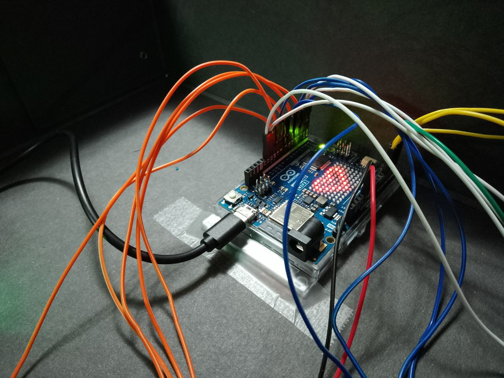

# Smart Parking City 🚗

Prototype of a smart parking system implemented at the municipal level, designed to show how the introduction of **IoT devices** (*Internet of Things*) can facilitate people's lives.

-----------------------------------------------------------------------------------------------------------
-----------------------------------------------------------------------------------------------------------

## Index
1. [The world of IoT 🌐](#the-world-of-iot-globe_with_meridians)
2. [Project overview 🚗](#project-overview-red_car)
3. [Materials 🛠️](#materials-hammer_and_wrench)
4. [Circuit 🔌](#circuit-electric_plug)
5. [Code 👨‍💻](#code-man_technologist)
6. [Interdisciplinary connections 🔗](#interdisciplinary-connections-link)
7. [Conclusions on the experience 💭](#conclusions-on-the-experience-thought_balloon)
   
-----------------------------------------------------------------------------------------------------------
-----------------------------------------------------------------------------------------------------------

# The world of IoT :globe_with_meridians:

Before diving into the project itself, it's worth introducing the concept of the "*Internet of Things*".
## An interconnected world
The world is witnessing a rapid expansion of digital networks, enabling devices to connect and share information. This phenomenon, known as ***digital transformation***, involves applying digital technology to foster innovation and progress.
**Sensors** are now everywhere: they allow the collection of vast amounts of data, which can be stored, analyzed, and used for a variety of purposes, such as monitoring the environment, predicting population growth, managing waste, enhancing home security, and much more.

**Fun Fact** 💡: The proliferation of affordable processors and wireless networks has facilitated the spread of IoT devices. It is predicted that by 2025, there will be 38.6 billion devices connected to the Internet, increasing to 50 billion by 2030, with an average of 190 million new devices every month.

## Internet of Things
### What is IoT?
> **“*Internet of Things*” (IoT) is an interconnected network of physical devices (*things*) that communicate and exchange data to improve efficiency and human experience in various sectors, using sensors, actuators, and other technologies.**

## What characteristics should an IoT device have?
- **Connectivity:** The ability to reliably connect to networks using effective communication technologies and protocols.
- **Sensors and Actuators:** The ability to sense the environment through sensors and act on it via actuators; this functionality allows the device to collect data, make decisions based on that data, and potentially influence the surrounding environment.
- **Automation:** The implementation of self-managed processes that reduce and eventually eliminate the need for human intervention; IoT opens a new world where activities that previously required human involvement can become automated.
- **Scalability:** As IoT environments can vary greatly in size and complexity, devices should be designed to scale easily, allowing them to be used in small home networks or large industrial networks.
- **Security:** Data integrity and security are crucial in the IoT realm, especially when dealing with sensitive information or critical devices.
- **Interoperability:** The ability to interact with other devices and systems, essential for effective communication between devices from different manufacturers and platforms.
- **Energy Efficiency:** Many IoT devices are powered by batteries or limited energy sources; energy efficiency is key to ensuring long battery life and reducing environmental impact.
- **Remote Maintenance and Updates:** Essential to ensure that IoT devices remain secure and up-to-date over time.

## How do IoT devices connect to the network?
A **sensor** must be connected to a network so that the collected data can be stored and shared.
The **controller** is responsible for gathering data from sensors and ensuring connectivity: it can either make immediate decisions or send data to a more powerful computer for analysis.
These elements typically work together with a device called an **actuator**. Actuators receive electrical input and convert it into physical action.

## Pros and cons
The IoT offers numerous **advantages**, enabling the efficient collection and analysis of data from sensors. Companies benefit from detailed insights into their products and customers, optimizing production and targeting marketing effectively. Cities manage traffic, recycling, healthcare, and transportation needs. Individuals benefit in terms of health, home security, and reduced energy costs.

At the same time, it’s important to consider the **disadvantages**: companies developing wearable devices have access to users' personal information; reliance solely on online purchases could lead to job losses; retailers know all the purchases made; a network disruption can have catastrophic consequences.

-----------------------------------------------------------------------------------------------------------
-----------------------------------------------------------------------------------------------------------

# Project overview :red_car:

## Briefly...

The project involves developing a prototype of a **smart parking system** implemented at the municipal level. It consists of a scaled model of a municipal road with **three different types of parking spaces**, each demonstrating a potential IoT application to facilitate management. Data collected by sensors is transmitted to a network application, allowing real-time monitoring of parking occupancy and storing historical data for analysis and future predictions.

-----------------------------------------------------------------------------------------------------------

-----------------------------------------------------------------------------------------------------------

-----------------------------------------------------------------------------------------------------------

-----------------------------------------------------------------------------------------------------------

-----------------------------------------------------------------------------------------------------------

-----------------------------------------------------------------------------------------------------------

## Purpose

The project aims to demonstrate how the introduction of IoT devices can significantly improve the **quality of life** by focusing on urban parking contexts.

Integrating these technologies offers several practical advantages, including receiving **real-time updates** on parking space availability, thereby reducing the time and stress associated with finding parking. Moreover, using sensors and prediction algorithms enables **accurate estimates** of future parking availability, helping drivers better plan their trips. These innovations can reduce traffic congestion caused by parking search, enhance urban transport efficiency, and contribute to a more sustainable environment by reducing CO2 emissions. The data collected can also assist municipal administrations in optimizing urban space management by identifying areas with high parking demand and planning targeted infrastructure interventions. Another advantage is the ability to integrate automated payment systems, allowing users to reserve and pay for parking via an app, making the process quicker and more convenient.

In summary, the project not only aims to demonstrate the effectiveness of IoT devices in improving parking management but also highlights how these technologies can contribute to creating smarter and more livable cities, enhancing citizens' quality of life through innovative and sustainable solutions.

## Prototype

The prototype features **three types of parking spaces**, each with unique characteristics and functionalities.

### **Free parking**

The project includes two free parking spaces with indefinite free parking. Each is equipped with an *ultrasonic sensor* and an *LED indicator* that shows its **status**. When the sensor detects an obstruction for a certain period, the parking space is marked as occupied (LED on). Conversely, if no obstruction is detected for a certain period, the space is indicated as vacant (LED off).

### **Timed parking**

The project also includes two timed parking spaces for short-term parking. In addition to the functionalities of free parking spaces, these spaces have a **maximum occupancy limit**, valid only from Monday to Saturday between 8:00 AM and 8:00 PM. During this interval, if the limit is exceeded (with a certain tolerance), the LED indicator of the slot will begin **flashing** (in a real scenario, automatic notification could be implemented). Outside of these hours, the parking space is free.

**Fun fact** 💡: The flashing LED, a clear and visible signal to all, aims to promote **parking rules compliance**, as people naturally tend to avoid behaviors that might cast them in a negative light. There exists a psychological principle where people adjust their behavior when aware of being observed or when undesired actions are made visible to all.

### **Paid parking**

The paid parking consists of 5 parking spaces, accessible via a one-way alternating traffic system. It features an access barrier (controlled by a *servo motor*), two *infrared sensors* to detect vehicles, two *LED indicators* functioning as traffic lights, a *photoresistor*, and three additional *LED indicators* for managing automatic lighting. The parking cover includes dummy photovoltaic panels, which in a real context could provide renewable energy to power parking devices.

#### Access regulation

Entries and exits from the parking lot are monitored by sensors that constantly update the **vehicle count**. A green light signals available parking spaces, allowing entry, while red indicates all spaces are occupied and entry is temporarily denied.

**Entry to the parking lot**:
- The user approaches the sensor at the entrance.
- If spaces are not all occupied (green light), after a brief detection period, the user retrieves a ticket for payment.
- The barrier opens, closing only when the sensor beyond the barrier is activated and then deactivated, indicating the vehicle has completely passed through.
- Only at this point will the parking counter be incremented by one.

**Exit from the parking lot**:
- The user approaches the sensor at the exit.
- After a brief detection period, the user returns the paid ticket.
- The barrier opens, closing only when the sensor beyond the barrier is activated and then deactivated, indicating the vehicle has completely passed through.
- Only at this point will the parking counter be decremented by one.

#### Automatic lighting

The parking lot features an automatic lighting system activated by a **photoresistor**. This sensor detects when the brightness level falls below a preset threshold for a given time interval, thereby activating the three white LEDs used for parking lot illumination.

## Parameter adaptation

For practicality, adjustments have been made to certain parameters, with values **differing from real-world settings**. Below is a summary table.

| Parameter | Real value | Demonstrative value | Description |
| --- | --- | --- | --- |
| Detection time | 30 seconds | 3 seconds | Time required for a sensor to detect a vehicle, to prevent errors caused by momentary interference. |
| Detection distance | 2.5 meters | 5 cm | Threshold distance within which a vehicle is detected in a parking space. |
| Maximum time in timed zone | 1 hour (+ 15 minutes tolerance) | 16 seconds (+ 4 seconds tolerance) | Maximum time for occupying a disc parking space, with a 25% tolerance. |
| Brightness stabilization Time | 20 seconds | 2 seconds | Time required before dusk lights turn on or off, to prevent flickering when brightness is near the threshold.

#### Notes
- Separate exit was not provided due to the relatively small parking area and its non-necessity for project demonstration purposes. Alternatively, a function preventing entry and exit (by turning on the red light) when both sensors are activated, indicating two vehicles approaching simultaneously from opposite directions, was introduced.
- The payment system was not included as it was irrelevant for project demonstration purposes but would be essential in a real-world implementation.

## Application

*The interface is available in both "desktop" (horizontal) and mobile (vertical) versions.*

The project also includes an **application** (hosted on *Arduino IoT Cloud*) that allows checking the **real-time status** of parking spaces, analyzing **historical data** on parking occupancy, and providing information on hourly distribution of slot occupancy. This can offer various advantages such as facilitating parking search, estimating future availability, reducing traffic congestion, contributing to a sustainable environment, and optimizing urban management...

Indicators display the status of individual parking spaces, while graphs facilitate analysis of collected data. For more detailed and extended periods of investigation, downloading a **CSV file** containing a summary of all historical data allows further analysis using specialized software such as Excel.

*App in action*.

-----------------------------------------------------------------------------------------------------------
-----------------------------------------------------------------------------------------------------------

# Materials :hammer_and_wrench:

## Modellino
- Scatola di cartone con coperchio: 62,0 x 44,0 cm x 10,0 cm
- Scatola di cartone argentato: 34,0 cm x 18,5 cm x 13,0 cm
- Nastro adesivo (trasparente e colorato) e biadesivo
- Cartone ondulato
- Cartoncino
- 3 legnetti
- 4 stuzzicadenti
- Plastilina grigia
- Stecco del ghiacciolo

## Mappa

*(realizzata tramite il software CorelDRAW Essentials 2021)*

La mappa illustra un percorso stradale che presenta **3 tipologie di parcheggio** distinte, ciascuna con le proprie peculiarità e scopi dimostrativi.

**N.B.:** Si precisa che la mappa è concepita esclusivamente a fini **teorici e concettuali**, pertanto alcune delle sue caratteristiche potrebbero non essere praticamente applicabili in una situazione reale su strada.

## Componenti del circuito
La tabella sottostante riporta i diversi componenti impiegati nel circuito. Per le specifiche tecniche complete consultare i rispettivi *datasheet*.
| Componente | Quantità | Descrizione |
| --- | --- | --- |
| [`Arduino UNO R4 WiFi`](https://docs.arduino.cc/hardware/uno-r4-wifi/) | 1 | **Arduino** è una piattaforma hardware e software *open-source* con cui realizzare dispositivi digitali in grado di interagire con il mondo esterno attraverso sensori e attuatori ([datasheet](https://docs.arduino.cc/resources/datasheets/ABX00087-datasheet.pdf)). |
| [`Breadboard`](https://www.amazon.it/AZDelivery-Breadboard-830-Arduino-Raspberry/dp/B07K8PQ4B5/ref=sr_1_2_sspa?crid=1LMAFIJE2TP5X&dib=eyJ2IjoiMSJ9.xi5AD3br6MkhFSnelneIz7280DzKo1UPIgHXXQxS0vDi-8Bj8_KMO0Ft7mOEqn_c4DgwRgptPgED-dbL794yeQGaXmW2_qVZUJwOZC9koeBdMlCEWO5zqT9bsy9L2nphxe2txNQFNUz6pkFSZn8p07Ap2cJVg1HmHG6fYz52zx-99Eig9D_CrKX9PWKCvcmJHxeDd1Yq5woqp8RimPIKu8p5l6XgSiEbDgoBknKcrwAFMY1qN1KmEPWghXLIkrgJr-bDWcngQiwzBPV1lfq6UnJalqQV_hPRmeFzyHoQ3pc.CoHS3PYbmqBx3LB_7yP7nYr01mM75NqVi_AmuokDvlI&dib_tag=se&keywords=breadboard%2Bazdelivery&qid=1711213155&sprefix=breadboard%2Baz%2Caps%2C111&sr=8-2-spons&sp_csd=d2lkZ2V0TmFtZT1zcF9hdGY&th=1) | 1 | Una breadboard è una base di costruzione *solderless* utilizzata per costruire prototipi **semipermanenti** di circuiti elettronici. |
| [`Sensori ad ultrasuoni HC-SR04`](https://www.amazon.it/HC-SR04-Misuratore-Distanze-Ultrasuoni-Ultrasonic/dp/B01COSN7O6/ref=sr_1_1_sspa?__mk_it_IT=%C3%85M%C3%85%C5%BD%C3%95%C3%91&crid=30NWWH1A2DL14&dib=eyJ2IjoiMSJ9.YPGfdw-5BDSrtfbP8kv-6aGGle4kgcSXSrlzpcqGoPsfcnfizPwGRtIYfIKsq8itrG6JeKxwGq2DwFn2DMf3zIOc5y_8k_RRBCZPZdmaIo9Gq8HodidfIYzK55jsxE15lHQb5P9RAw47zHFb6QvEz25AzeJv8u7KZ16vRqjMBMAjXJQQq62uieufO6f0KGgoCKjZyjgB0C6J_I2DyW6kR0wi-I-azZVeTOnXJJl8Rr1pkvhKk88J7EMqu6S0r-TB6uziPzrA0N30beduj5U6ryeTwGEe2sOSwjErChZhAa0.2y-gnTMdJfhvV7wX6Yj0LG5YkOOeMEmsXL6mW3etajA&dib_tag=se&keywords=hc-sr04&qid=1710178436&sprefix=hc-sr04%2Caps%2C119&sr=8-1-spons&sp_csd=d2lkZ2V0TmFtZT1zcF9hdGY&psc=1) | 4 | Un sensore ad ultrasuoni è un dispositivo che misura la distanza di un oggetto emettendo onde sonore **ultrasoniche** e convertendo il suono riflesso in un segnale elettrico. <ul><li>Alimentazione: 5V DC</li><li>Portata: 2 cm - 300 cm </li><li>Angolo effettivo: <15°</li></ul> |
| [`Sensori ad infrarossi`](https://www.amazon.it/AZDelivery-ultrasuoni-distanza-Raspberry-Abstandsensor/dp/B07D924JHT/ref=mp_s_a_1_5?dib=eyJ2IjoiMSJ9.N_u-ND_UNSKzILwTb_kxjlsZcEJNcU5Le3Hu39DGXwD1VZKRyrOdLBsll-pX1661BkCRVFys71-XLrlVqggrRjAohvOBZQRBgTgw6dQHC427BW-roSgnvJVozBauLSVE2-UaNJdcLvi581S5n_ZWF1OW3G5-9n3PBW2uPtV2ShYr_AD1vIiHsBmQy3Bxs5FrI4oLC_FK1V0thHQPpEed7A.yO1UcKvXtKMLtSVnJ6Q17CHAcejGBa83jLJXz3p3RHQ&dib_tag=se&keywords=Arduino%2BIr%2BSensor&qid=1710180504&sr=8-5&th=1) | 2 | Un sensore a infrarossi (IR) è un dispositivo che misura e rileva la radiazione infrarossa nell'ambiente circostante, utilizzato spesso come rilevatore di **prossimità**. <ul><li>Alimentazione: 5 V DC</li><li>Portata: 2 cm - 30 cm </li><li>Angolo effettivo: <35°</li></ul> |
| [`LED`](https://www.amazon.it/AZDelivery-Emissione-Circolare-Emettitore-compatibile/dp/B08T1YGM8K/ref=sr_1_8?__mk_it_IT=%C3%85M%C3%85%C5%BD%C3%95%C3%91&crid=2G25R9Q9KMV7M&dib=eyJ2IjoiMSJ9.Am2uI2a0USpWEEaWXZ90u194WS8WKSs1QZNDmJ6hj8_hYjaYFnkLlHD6lVWbkPfdHygL7TaWlO8mNwOuxr-frFUB0bavzQ94Ibj_YaqSa1V1ME1AiB6mrNFXCaHSsiUCMdFt-A4Ifhh9wUiVrrhQ3m4ttITdREQZFpaWtH6MWmbqbfQq1p714WPJp3kfOx224M1b20MTaLoXEOwoxqgkREE7-gup46SCvOQlz043GhnGBglaU4R-J4IT82WMzcNHRLVTaOKyj0LCsq0WJIhUfid-j2uI-_CjezbgR3MpGww.0WSwAdpsbW0cjDMWK-UAEMssRI6VXRBNlLM9M9BpgCs&dib_tag=se&keywords=led+arduino&qid=1711231790&sprefix=ledsarduino%2Caps%2C106&sr=8-8) | 9 | Un LED (*Light Emitting Diode*) è un dispositivo a semiconduttore che emette **luce** quando attraversato da una corrente elettrica. <ul><li>(4x) LED blu (*Vf* = 2,7 V; *If* = 20 mA)</li><li>(3x) LED bianchi (*Vf* = 2,7 V; *If* = 20 mA)</li><li>(1x) LED verde (*Vf* = 2,5 V; *If* = 20 mA)</li><li>(1x) LED rosso (*Vf* = 1,9 V; *If* = 20 mA)</li></ul>|
| [`Resistori`](https://www.amazon.it/AZDelivery-Resistenze-Resistori-Arduino-gratuito/dp/B07Q87JZ9G/ref=mp_s_a_1_3?crid=2TC9BVKNFDZ8E&dib=eyJ2IjoiMSJ9.m5BpWsNponXDu2NgiZft18byMuQH5acGxvlPhkBDKIAP6-y2xkoGZDoyxxVfIyDYEAg99g_jaLYLPw8QVpi4V4XCuJx9dncmhRd_uYIwo9uobWLQXDFQJ4iGopYZX5K_RucRwQR4Q-SBcYHL1jgJWOIpFCjRGIo-STIrgjKXDrMMtJ_gDsPfRLhde17dlA3fmogNdJBKoq52tJmEmCQ0lA.9eHZDTs0PXLqoFtuXdFetqe9rQbFbAhfiUGoJ44W2ts&dib_tag=se&keywords=azdelivery+resistor&qid=1711229207&sprefix=azdelivery+resistor+%2Caps%2C168&sr=8-3) | 10 | Un resistore è un componente elettronico che limita il flusso di corrente in un circuito, determinato dal suo valore di resistenza misurato in ohm, essenziale per **regolare** la quantità di corrente che attraversa il circuito e proteggere i componenti sensibili. <ul><li>(9x) Resistori da 470 Ω, 1/4 W</li><li>(1x) Resistori da 10 kΩ, 1/4 W</li></ul> |
| [`Fotoresistore`](https://www.amazon.it/AZDelivery-fotoresistenti-LDR5528-compatibili-Arduino/dp/B089YNCYG4/ref=sr_1_7?__mk_it_IT=%C3%85M%C3%85%C5%BD%C3%95%C3%91&crid=2A3APBD8O8PY&dib=eyJ2IjoiMSJ9.QA9xJKurHImIT1lWJXxxdlnbVU5UKDHiJiSE8BfTa5shSX8N_5-MaEax9oqEEga5oNdL8Azt-5rqM3ElFDL3_B0r6F1qAQhCQTbHtBPYBOur-ZnERjDBQYsBogf_XU816SJLQFBg719l7WRvUNZGG7LiAoieR9oRcJriKK3CDxooxr4I4-moYNi1UXT8sbimDNixjAUhLv2dQ-H4lnygvw2ixt41P2KxyN8yO6ETdJ9fLiwU0NgUWKRUQkIr3XEbgrfC6cIpOYQ1T80aCICCmrM0zGWEunkuGV8vYIbvqds.Z_CgHc8fCiFFLbCQ0lHBB4iV51wunor6gzONEHCuHQs&dib_tag=se&keywords=photoresistor%2Bldr&qid=1711311437&sprefix=photoresistor%2Bld%2Caps%2C114&sr=8-7&th=1) | 1 | La fotoresistenza è un componente elettronico la cui resistenza è inversamente proporzionale alla quantità di luce che lo colpisce, il che lo rende adatto per la realizzazione di **luci crepuscolari**.|
| [`Servo motore SG90`](https://www.amazon.it/AZDelivery-Servomotore-compatibile-Elicottero-Arduino/dp/B07CYZK379/ref=sr_1_3_sspa?dib=eyJ2IjoiMSJ9.H5GMwpa4wNe8ulI-HmmzdcDht2QFTc48OwjhYYXIGgnF_nrgGONIOFU5ZTkcfWKfsql0zVMRrjnDoI1RDVFKbSKTAc8BVYbfDwlvx7gUBatWIHzP4UajWxboJIyJEdFu6NJDMSqDGAm6o207fv4AhQjXq59-yz3EZihzw5uH_0ZfiRZKMJWrpRNE2Z6cYtxTJxzI5ZC9MJeLHkQZb6y57rli0luWh3UFG2-qbtL_fFc-jzGfIWlapPriDetNoK6c0iaOqV0gYQqzO__K9Kn788wdh8yWWhfTVFtSnvadwKg.lN3SZuhmgmwKlqWWHE71rGuFKolFMLjj86eRxRc3MsI&dib_tag=se&keywords=arduino%2Bservo%2Bmotor&qid=1710865115&sr=8-3-spons&sp_csd=d2lkZ2V0TmFtZT1zcF9hdGY&th=1) | 1 | Un servo motore è un dispositivo che converte un segnale di controllo in movimento **preciso e controllato**, comunemente utilizzato per il controllo di posizione in sistemi robotici e automazione industriale. <ul><li>Alimentazione: 4,8 - 6 V DC</li><li>Angolo di rotazione: 180 ° </li><li>Velocità: 0,1 s su 60°</li><li>Coppia: 2,5 kg/cm</li></ul> |
| [`Jumper wires`](https://www.amazon.it/gp/aw/d/B07KCFG5YX/?_encoding=UTF8&pd_rd_plhdr=t&aaxitk=de9838076b80169474b4678f431464e9&hsa_cr_id=3263644680502&qid=1711312198&sr=1-1-e0fa1fdd-d857-4087-adda-5bd576b25987&ref_=sbx_be_s_sparkle_lsi4d_asin_0_title&pd_rd_w=rpZDT&content-id=amzn1.sym.b580b30c-dd62-441e-ab95-5e749dbe7889%3Aamzn1.sym.b580b30c-dd62-441e-ab95-5e749dbe7889&pf_rd_p=b580b30c-dd62-441e-ab95-5e749dbe7889&pf_rd_r=JVVYGQ2GXAEZ3D0TW82Y&pd_rd_wg=FwLuU&pd_rd_r=161e4473-fa7a-4822-8c9c-0136839bec18&th=1) | ~200 | I jumper wires sono cavi elettrici **corti e flessibili**, utilizzati per connettere componenti elettronici tra loro in modo rapido e senza saldatura. Si distinguono in *male-to-male*, *male-to-female* e *female-to-female* in base al tipo di estremità.|
| [`Powerbank 5V`](https://www.amazon.it/Powerbank-10400mAh-Caricabatterie-Portatile-Smartphone/dp/B07K1D2T5Z/ref=sr_1_5?__mk_it_IT=%C3%85M%C3%85%C5%BD%C3%95%C3%91&dib=eyJ2IjoiMSJ9.BIPnA8BKQhI8x_Uw5NNC-ug9yp0vTNsgVnbbs540ql1PzfFz5pwgr0mGNSesYeJonzmXacp1TX9ZhE54HvZrd02JtxGU_I9_gg2Qh0CFwFtPZcHX8Y-x8moMi_ZY8JzwNdqkyksxVemAAdcSNruSDtnZnticvLbntWML0MupUhjskF9LliKCn8-lI9b5xmm-aM1YmUO5QdJBMt2eY57vMuqlD9gqqqhOY_xsK5dqe8PoOnjdU8szz8SnYLFUxn9mbz4nRnuMUTmGxes365E4yqdYn0ZI_vLXLLmywo92t_M.7kuAkz54nGoahHmgf3QfydIKKFDvwwCP2OTcN0c8bns&dib_tag=se&keywords=power+bank+5+volt&qid=1713165582&sr=8-5) | 1 | Un powerbank è una fonte di energia **portatile** progettato per alimentare dispositivi **USB**, fornendo energia attraverso batterie interne ricaricabili. <li>Tensione: 5 V</li><li>Corrente (max): 3 A</li><li>Capacità: 10400 mAh</li> |
| [`Batterie AA`](https://www.amazon.it/GP-Batterie-alcaline-extra-Pack/dp/B07QLY7GJM/ref=sr_1_51?adgrpid=52877419152&dib=eyJ2IjoiMSJ9.7qd2mWgPWlRveGEJRbjXJNr_1e9RKYC6IRoJ2DMJVN8DdBdwJqCzqK73YUGTu7Fp6M8yQAk3qMl9dYuvGwGbMX7USwwgVBXJGIIQ5_AyID0oKvImWeARVVw5WJEQ0Yu4qGTWo3c7yk3QvBtwPNUi0jkd5V4RcMvFwj5okyh7y0IhIXa5eOPrGXhx_wAhMs2IetHvDGn6JOylqSXNwCbYjeA4Rl0DjkUd5rvQNbVtBsfFoNIqIcWG39teBqrWrV3nV3eMhC6yga41q2zkZMfY9eRJsmqzn6z_76V3YKGhaRc.uM6QNZjC_zp7i0GUddvcEFiaSM3V_ZWUb_dckQprSA4&dib_tag=se&hvadid=591172535230&hvdev=c&hvlocphy=20530&hvnetw=g&hvqmt=e&hvrand=7053405220002942603&hvtargid=kwd-297014870873&hydadcr=16358_2167162&keywords=batterie+aa&qid=1714133456&sr=8-51) | 4 | La batteria AA è una fonte di energia **portatile** di dimensione standard, comunemente utilizzata in dispositivi elettronici di piccole dimensioni. <li>Tensione: 1,5 V</li><li>Composizione: alcalina</li> |
| [`6V case per batterie AA`](https://www.amazon.it/GTIWUNG-Portabatterie-Batteries-Titolare-Batteria/dp/B07WJ3HFSP/ref=sr_1_4_sspa?__mk_it_IT=%C3%85M%C3%85%C5%BD%C3%95%C3%91&crid=1H1FAUSVDY2ZO&dib=eyJ2IjoiMSJ9.VaIPkWXh1vEz2NWlzy-bskl9fVmzWq7qeBQ8_ApM4FPnZ8V06gFMpukyYOf0ioPXd84rmuTRhwcCTQ-VyXnU4EB3BAxMwPgJyKHS5BD2nhbk5AyTJEGofYvVUIhDMtfrEYWUxj76uI_8QnKTrhU6xVS8KeJ8W6aC3NxHL-sjlnikRBs7oRnvvSmNphDlNJrFtqXkM1Psx928dYTdv8xYIyf37HDewKhmBF5k6ltBX6ugh2mP0TILY5vQ6Vt7XLJGf1b0Tg2dlh3lrgPXofts5vrMIoWyVe_076TEcwlvY2E.PCfiGvevFAiXFAPFaMBk1aE8f2rlIRc813mSuyq8xkc&dib_tag=se&keywords=aa%2Bbattery%2Bholder&qid=1711374901&sprefix=aa%2Bbattery%2Bhgolder%2Caps%2C109&sr=8-4-spons&sp_csd=d2lkZ2V0TmFtZT1zcF9hdGY&th=1) | 1 | Contenitore utilizzato per collegare 4 batterie AA in serie, generando una tensione totale di 6V. |

-----------------------------------------------------------------------------------------------------------
-----------------------------------------------------------------------------------------------------------

# Circuit :electric_plug:

*Schema del circuito*

-----------------------------------------------------------------------------------------------------------

*Vista dall'alto*

-----------------------------------------------------------------------------------------------------------

*Particolare*

-----------------------------------------------------------------------------------------------------------

*Particolare*

-----------------------------------------------------------------------------------------------------------

*Particolare*

-----------------------------------------------------------------------------------------------------------

*Particolare*

-----------------------------------------------------------------------------------------------------------
Il circuito che gestisce il funzionamento del prototipo si occupa delle seguenti funzioni:
- **Alimentare** il microcontrollore Arduino e il servo motore.
- **Connettere** i vari sensori e attuatori ad Arduino in modo che possano essere **controllati** tramite codice.

Analizziamone ora le caratteristiche nello specifico.

## Alimentazione

### Arduino
Tra le varie opzioni di alimentazione per la scheda, si è scelto di utilizzare il **connettore USB-C® integrato**. È il metodo più comune, semplice e sicuro, poiché la tensione (*5 V*) e la corrente (*500 mA max*) sono **regolate e standardizzate** secondo le specifiche USB. Oltre all'Arduino, il connettore USB consente di alimentare anche i vari componenti connessi al pin *5v* della scheda.

Dato che la massima intensità di corrente concessa è di 500 mA, è stato necessario verificare che i dispositivi collegati ad Arduino non superassero complessivamente questo limite.

| Componente | Corrente massima | Quantità | Corrente totale massima
| --- | --- | ---| --- |
| `Sensore ad ultrasuoni` | ~5 mA | 4 | ~5 mA x 4 = **~20 mA** |
| `Sensore ad infrarossi` | ~5 mA | 2 | ~5 mA x 4 = **~10 mA** |
| `LED` | ~20 mA | 9 | 20 mA x 9 = **~180 mA** |

*(Il pin di controllo del servo motore e il fotoresistore consumano una quantità di corrente talmente bassa da potersi considerare trascurabile).*

La corrente totale massima è quindi pari a ~210 mA, abbondantemente entro il limite di 500 mA.                                         
**N.B.:** sebbene, a livello teorico, la massima corrente consumata da ciascun LED è pari a ~20 mA, nel circuito non supera mai gli 8 mA (per ragioni che saranno spiegate in seguito). Pertanto, la corrente massima (**~100 mA**) utilizzata risulta ancora minore.

### Servo motore
Il servo motore si distingue dagli altri componenti per il suo consumo di corrente **instabile**, caratterizzato da picchi di corrente elevati che potrebbero danneggiare il microcontrollore. Per questo motivo, è consigliabile alimentarlo tramite una fonte esterna, avente una tensione compresa tra 4,8 e 6 V. Di conseguenza, si è optato per l'utilizzo di **4 batterie AA** (1,5 V ciascuna) collegate in serie.

## Sensori
I sensori si occupano di rilevare alcune condizioni ambientali al fine di comunicarle al controllore.

### Sensori ad ultrasuoni
Un sensore ad ultrasuoni funziona emettendo impulsi sonori ad **alta frequenza**, al di fuori dell'udibile dall'orecchio umano, e misurando il tempo che impiega per questi impulsi a riflettersi da un oggetto e tornare al sensore. Conoscendo la velocità del suono nell'aria, il sensore calcola la distanza basandosi sul tempo impiegato dagli impulsi per viaggiare avanti e indietro, in base alla seguente formula:

$$distance =\frac{speed\ of\ sound \times time}{2}$$
  

Il sensore è dotato di 4 connettori: *VCC* per l'alimentazione, *GND* per la terra, *ECHO* e *TRIG* per il controllo. I primi due sono collegati rispettivamente ai pin *5v* e *GND* dell'Arduino, attraverso la breadboard. I connettori *ECHO* e *TRIG* gestiscono l'invio e la ricezione degli ultrasuoni e possono essere collegati allo stesso pin GPIO (*General Purpose Input/Output*) del microcontrollore, poiché operano in modo alternato.

La scelta di questo sensore per il rilevamento dei parcheggi è motivata dalla sua **precisione** nelle misurazioni della distanza dei veicoli, consentendo una **facile regolazione** per adattarsi a vari tipi di parcheggio. Inoltre, non è influenzato da luce, fumo, polvere e caratteristiche delle superfici riflettenti (eccetto superfici morbide, che possono assorbire gli ultrasuoni anziché rifletterli; tuttavia, questo non è un problema nel contesto del rilevamento dei parcheggi).

### Sensori ad infrarossi attivo
Un sensore ad infrarossi attivo funziona emettendo un fascio di luce infrarossa e poi rilevando la sua riflessione. Quando un oggetto si trova nel percorso del fascio, la luce infrarossa viene riflessa verso il sensore, il quale rileva la presenza dell'oggetto. Questa variazione nella riflessione della luce è interpretata come la presenza di un oggetto davanti al sensore.

Il sensore dispone di 3 connettori: *VCC* per l'alimentazione, *GND* per la terra e *OUT* per il controllo.  Il collegamento ad Arduino è analogo a quello del sensore ad ultrasuoni.

La scelta di utilizzare questo sensore per la rilevazione dei veicoli all'accesso del parcheggio a pagamento è motivata dalla sua **affidabile** capacità di rilevare la presenza di un oggetto di fronte a sé, nonché dalla sua **facilità** di utilizzo. Tuttavia, a differenza del sensore ad ultrasuoni, non è in grado di fornire misurazioni precise, quindi non è raccomandato per il rilevamento dei parcheggi. È inoltre particolarmente sensibile alle condizioni di estrema luminosità, rendendolo inadatto per applicazioni esposte ad una forte luce solare.

La volontà di utilizzare due diverse tipologie di sensori nel prototipo deriva anche dalla volontà di effettuare un confronto tra i due, così da delineare i rispettivi **vantaggi e svantaggi**.

### Fotoresistenza

Il fotoresistore, pur non essendo un sensore vero e proprio ma una *resistenza*, costituisce l'ultimo componente di questa categoria. È un dispositivo elettronico che **modifica** la propria resistenza in base all'**intensità luminosa** a cui è esposto. Quando la luce colpisce il materiale fotosensibile all'interno del dispositivo, gli elettroni vengono eccitati, aumentando la conduttività del materiale e, di conseguenza, diminuendo la resistenza del fotoresistore. Questa variazione di resistenza viene sfruttata per controllare altri elementi del circuito elettronico, come, ad esempio, l'attivazione o la disattivazione di una luce crepuscolare in risposta ai cambiamenti di luminosità ambientale.

Poiché i pin di Arduino non sono in grado di misurare direttamente una variazione di resistenza ma solo di tensione, il collegamento del fotoresistore avviene tramite un circuito noto come "***partitore di tensione***". Questo circuito è composto da due resistenze collegate in serie a una fonte di tensione. La tensione si distribuisce sulle diverse resistenze in base ai loro valori, secondo le regole delle *resistenze in serie* e alla *legge delle maglie di Kirchhoff*. Nel nostro caso, le due resistenze sono il fotoresistore (variabile) e un resistore da 10 kΩ (un valore standard per garantire una buona sensibilità e un basso consumo di corrente), mentre la fonte di tensione è il pin *5V* del microcontrollore.
Successivamente, un GPIO pin analogico di Arduino (in questo caso *A5*), è connesso in mezzo alle due resistenze. Trattandosi di un pin analogico, esso è in grado di leggere una gamma di valori anziché solo un valore digitale. Il valore di tensione misurato può essere interpretato attraverso il codice per determinare il livello di luminosità ed effettuare le azioni necessarie.

## Attuatori
Gli attuatori si occupano di convertire i segnali del microcontrollore in azioni fisiche.

### LED
Il circuito utilizza 9 LED, diodi a semiconduttore che emettono **luce** quando attraversati da corrente elettrica. Ciascun LED è controllato tramite un pin digitale GPIO di Arduino, con l'eccezione di 3 LED collegati a pin analogici, che possono funzionare anche come digitali (tuttavia tale flessibilità non vale al contrario, in quanto pin digitali non possono fungere da analogici). Nello specifico, ogni LED è dotato di un *anodo* (terminale positivo) connesso al pin della scheda e di un *catodo* (terminale negativo) collegato al *GND* del microcontrollore.

Ogni LED possiede 2 importanti proprietà:
- ***Caduta di tensione diretta** (Vf)*: tensione necessaria affinché possa fluire corrente attraverso il LED.
- ***Corrente diretta massima** (If)*: valore massimo di corrente che può attraversare il LED senza danneggiarlo. Nei LED utilizzati, equivale a **20 mA**.

Inoltre, ogni pin GPIO dell'*Arduino UNO R4 WiFi* ha un limite massimo di corrente che può essere assorbito da un dispositivo collegato senza danneggiare il pin, pari a **8 mA**. Quindi, per garantire che la corrente che scorre attraverso il LED sia inferiore a 8 mA, è necessario aggiungere un **resistore in serie** a ciascun LED. Per maggior sicurezza, si opta per una corrente ancora più ridotta, come **7 mA**.

Il valore idoneo della resistenza è stabilito dalla **prima legge di Ohm**:
> **"La differenza di potenziale ai capi di un resistore è uguale al prodotto della resistenza per l'intensità della corrente che lo attraversa."**

Definendo quindi *Vs* come tensione di alimentazione, pari a *5V* (standard erogato dai GPIO pin di Arduino), possiamo determinare il valore dei resistori in base alla seguente formula:
$$R=\frac{Vs - Vf}{If}$$

Possiamo dunque determinare il valore della resistenza per ogni colore di LED utilizzato.

| Colore del LED | Vf | If | Resistenza |
| --- | --- | ---| --- |
| `Blu` | 2,7 V | 7 mA | $$\frac{5,0 V - 2,7 V}{7 mA} = 328,6 Ω $$ |
| `Bianco` | 2,7 V | 7 mA | $$\frac{5,0 V - 2,7 V}{7 mA} = 328,6 Ω $$ |
| `Verde` | 2,5 V | 7 mA | $$\frac{5,0 V - 2,5 V}{7 mA} = 357,1 Ω $$ |
| `Rosso` | 1,9 V | 7 mA | $$\frac{5,0 V - 1,9 V}{7 mA} = 442,9 Ω $$ |

Dopo aver eseguito i calcoli e considerando la disponibilità del set di resistori, l'opzione migliore è utilizzare **un resistore da 470 Ω per ciascun LED**, in modo da assicurare che la corrente diretta attraverso ciascuno sia ben al di sotto del limite massimo di 8 mA.

**Curiosità** 💡: il valore di resistenza di un resistore è determinato dalle **bande colorate** visibili sulla sua superficie, rendendoli facilmente identificabili attraverso opportune tabelle o [tool](https://www.digikey.it/en/resources/conversion-calculators/conversion-calculator-resistor-color-code) online.

### Servo motore
Il servomotore è un dispositivo di ridotta potenza utilizzato per convertire un segnale di controllo in un **movimento preciso e controllato**. Questo processo è reso possibile grazie alla tecnica di modulazione chiamata ***PWM (Pulse Width Modulation)***. Un segnale PWM consiste in una serie di impulsi elettrici con una frequenza costante, ma con **durata variabile**. Questi impulsi assumono la forma di *onde quadre*, dove il valore può essere solo *HIGH* (*5V*) o *LOW* (*0V*). 
Quando Arduino controlla un servomotore, genera segnali PWM con diverse larghezze (che ne rappresentano la durata). Ad esempio, per spostare il servomotore in una posizione desiderata, Arduino invia impulsi PWM con una larghezza **proporzionale** a quella della posizione. Questa relazione tra larghezza dell'impulso e posizione del servomotore è stabilita nel *datasheet* del servomotore stesso e viene sfruttata da Arduino per controllarlo in modo preciso e deterministico.

Il servo motore possiede 3 connettori: *rosso* per l'alimentazione, *marrone* per la terra, *arancione* per il controllo. I primi due sono connessi al generatore da *6V*, mentre il cavo di controllo è collegato ad un GPIO PWM digitale, nello specifico al pin *D10*. 

-----------------------------------------------------------------------------------------------------------
-----------------------------------------------------------------------------------------------------------

# Code :man_technologist:
Le funzionalità del progetto sono controllate e gestite attraverso il codice, il quale è redatto nell'editor cloud di Arduino e successivamente caricato sul microcontrollore. Quest'ultimo conserva una copia del codice e lo esegue immediatamente all'alimentazione.

## Linguaggio
Il linguaggio di programmazione utilizzato nel progetto è ***Arduino***. È un linguaggio di alto livello basato su **C/C++** che include librerie e funzioni specializzate per interagire con l'hardware specifico di Arduino, come sensori, attuatori e moduli di comunicazione. 

## Sketches

Di seguito viene descritto in linea generale il funzionamento dei vari file di codice del progetto (definiti "*sketches*" nell'ecosistema Arduino). Per ulteriori approfondimenti, è possibile consultare direttamente i file, **commentati** nei minimi dettagli.

### - [`SmartParkingCity.ino`](https://github.com/RichardBoy05/Smart-Parking-City/blob/main/src/SmartParkingCity.ino)

Lo sketch sfrutta diversi sensori e componenti per monitorare l'occupazione dei posti auto, regolare ingresso e uscita nel parcheggio a pagamento, adattare l'illuminazione in base ai livelli di luce ambientale, gestire la connettività al cloud e visualizzare lo stato del sistema su una matrice LED incorporata.

#### Librerie
- `Servo.h`: controllo del servomotore.
- `EEPROM.h`: memorizzazione permanente dei dati.
- `NewPing.h`: uso dei sensori ad ultrasuoni.
- `thingProperties.h`, `ParkingSensor.h`, `LedMatrixConfig.h`, `Arduino_LED_Matrix.h`: gestione delle proprietà del dispositivo IoT, dei sensori di parcheggio e della matrice LED.

#### Funzione `setup()`
È eseguita **una volta** all'avvio del sistema e comprende:
- Inizializzazione della matrice LED e visualizzazione dello stato di setup.
- Connessione al cloud Arduino IoT.
- Configurazione delle modalità dei pin per i vari componenti.
- Inizializzazione delle luci automatiche e del servomotore.
- Lettura dei dati memorizzati nella memoria EEPROM.
- Impostazione delle luci dei LED allo stato iniziale.

#### Funzione `loop()`
È eseguita in **modo continuo** e include:
- Gestione della connettività con il cloud Arduino IoT.
- Aggiornamento della percentuale di occupazione del parcheggio.
- Gestione automatica delle luci in base alla luce ambientale.
- Regolazione dell'accesso al parcheggio a pagamento.
- Rilevazione dell'occupazione dei posti auto utilizzando i sensori di parcheggio.

#### Funzione `connectionHandler()`
Verifica la **connessione** al cloud Arduino IoT e tenta di riconnettersi in caso di disconnessione, con un numero limitato di tentativi per evitare blocchi indefiniti del codice.

#### Funzione `parkingAccessRegulator()`
Controlla l'**accesso** al parcheggio a pagamento utilizzando i sensori di ingresso e uscita e un servomotore per il movimento della sbarra. Gestisce le **luci** del sefamoro d'accesso e aggiorna il conteggio dei veicoli parcheggiati in tempo reale.

#### Funzione `setServoAngle(int angle)`
Imposta l'**angolo** del servomotore per aprire o chiudere la sbarra, con un breve ritardo per consentire il corretto posizionamento del motore, per poi disconnetterlo al fine di evitare vibrazioni e ridurre il consumo energetico.

#### Funzione `setupAutoLights()`
**Calibra** il livello di soglia di oscurità basato sulla lettura iniziale del sensore di luce (LDR).

#### Funzione `autoLights()`
Monitora il livello di luce utilizzando il sensore LDR e attiva o disattiva le **luci crepuscolari** in base al superamento della soglia di oscurità per un determinato periodo di tempo.

#### Funzione `updateParkedVehiclesCount(int change)`
**Aggiorna** il conteggio dei veicoli parcheggiati (aggiungendone o sottraendone uno) e **memorizza** il nuovo valore nella memoria interna EEPROM.

#### Funzione `updateParkingOccupationPercentage()`
Calcola la **percentuale** di occupazione del parcheggio sommando i conteggi dei posti occupati e aggiornando la variabile corrispondente.

-----------------------------------------------------------------------------------------------------------
  
### - [`ParkingSensor.h`](https://github.com/RichardBoy05/Smart-Parking-City/blob/main/src/ParkingSensor.h)

Lo sketch implementa una classe `ParkingSensor` per l'utilizzo dei **sensori ad ultrasuoni**, destinati al rilevamento dei veicoli nei parcheggi. Essi consentono di misurare la distanza di oggetti e determinare se un posto è occupato o libero. Il codice gestisce anche degli indicatori LED che segnalano lo stato dei parcheggi e aggiorna le corrispondenti variabili nel cloud.

#### Librerie
- `Time.h`: funzionalità di gestione del tempo.
- `NewPing.h`: uso dei sensori ad ultrasuoni.

#### Metodo pubblico `detectParking()`
**Rileva la presenza di un veicolo** nel posto auto e aggiorna l'indicatore LED di conseguenza. Nello specifico:
- Misura la durata dell'ultrasuono e calcola la distanza dall'oggetto rilevato.
- Se un veicolo è rilevato, registra il tempo di rilevamento e controlla il tempo massimo di occupazione.
- Se il parcheggio è occupato per un certo periodo, accende il LED e aggiorna la variabile cloud.
- Nel momento in cui non è più rilevato alcun veicolo, registra il tempo di assenza e spegne il LED dopo un certo periodo.

#### Metodo privato `updateCloudVariable(boolean state)`
Assegna lo **stato di un parcheggio** (occupato o libero) alle rispettive variabili nel cloud.

#### Metodo privato `checkMaxOccupationTime()`
Verifica se il **tempo massimo** di occupazione è superato per i parcheggi a zona disco. Nello specifico:
- Verifica se l'ID inizia con "T", indicando un posto a sosta breve.
- Ottiene il timestamp corrente dal cloud.
- Se non è domenica e l'ora è tra le 8:00 e le 20:00, verifica il tempo di occupazione del parcheggio: in caso superi il tempo massimo consentito, attiva il lampeggio del rispettivo LED.

-----------------------------------------------------------------------------------------------------------

### - [`thingProperties.h`](https://github.com/RichardBoy05/Smart-Parking-City/blob/main/src/thingProperties.h)
Lo sketch connette il dispositivo alla rete **Wi-Fi** e utilizza il cloud di Arduino IoT per monitorare e aggiornare lo stato dei parcheggi. Include variabili booleane, per indicare la disponibilità dei posti, e variabili intere, per contare i veicoli parcheggiati e calcolare la percentuale di occupazione. Le proprietà sono definite e registrate nel cloud di Arduino IoT per consentire il monitoraggio e gli aggiornamenti in tempo reale.

-----------------------------------------------------------------------------------------------------------

### - [`LedMatrixConfig.h`](https://github.com/RichardBoy05/Smart-Parking-City/blob/main/src/LedMatrixConfig.h)

Lo sketch definisce quattro **matrici bidimensionali** che rappresentano diversi stati visivi per un display grafico. Queste matrici sono progettate per essere visualizzate sulla matrice LED integrata nell'Arduino UNO R4 WiFi. Ognuna rappresenta uno stato specifico:
- "*running_matrix*": rappresenta la forma di un cuore, che indica uno stato normale e funzionante.
- "*setup_matrix*": rappresenta la forma di una clessidra, che indica uno stato iniziale di configurazione.
- "*attempting_reconnection_matrix*": rappresenta il simbolo del WiFi, che indica un tentativo di riconnessione.
- "*no_connection_matrix*": rappresenta una faccia morta, che indica l'incapacità di stabilire una connessione di rete.

Ogni matrice è definita come una serie di righe e colonne, dove ogni elemento rappresenta lo stato di un singolo LED sulla matrice. I valori binari sono utilizzati per indicare se un LED è acceso (1) o spento (0).

-----------------------------------------------------------------------------------------------------------
-----------------------------------------------------------------------------------------------------------

# Interdisciplinary connections :link:
Il progetto si presta inoltre ad alcuni possibili **collegamenti interdisciplinari** tra le materie scolastiche.

- **Informatica**: Nascita ed evoluzione delle reti digitali, in particolare il fenomeno della "*trasformazione digitale*";
- **Fisica**: circuiti in corrente continua, prima legge di Ohm, onde infrarosse;
- **Letteratura italiana**: Giovanni Verga e il mito del progresso, interpretato sia come "fiumana" inarrestabile e grandiosa che nei suoi aspetti più negativi (si veda [Pro e contro dell'IoT](#pro-e-contro)).
- **Storia dell'arte**: Art Nouveau, l'uso di materiali assemblati a freddo e quindi smontabili (esempio: il "Palazzo di Cristallo" di Joseph Paxton) è analogo al concetto del circuito *solderless* utilizzato, ossia un tipo di circuito semipermanente molto pratico per progetti di questo genere.

-----------------------------------------------------------------------------------------------------------
-----------------------------------------------------------------------------------------------------------

# Conclusions on the experience :thought_balloon:

Il progetto ha avuto origine grazie all'esperienza di PCTO "*Programma in rete*" 2023, organizzata dalla *Cisco Networking Academy*, durante il quale ho avuto la fortuna di conoscere per la prima volta il mondo dell'*Internet of Things*. Il corso mi ha permesso di acquisire molte competenze che, insieme alle mie conoscenze pregresse di programmazione, mi hanno consentito di provare a cimentarmi in questa attività.

Dopo mesi passati alla ricerca di un'idea da trasformare in un prototipo, il 3 marzo 2024 ho pensato di coniugare questa mia ambizione con una delle difficoltà che mi "attanagliava" di più in quel periodo: il **parcheggio**, nel tentativo di ottenere la tanto agoniata patente di guida. Nonostante le mie difficoltà fossero principalmente legate a "lacune tecniche", per empatia verso altri guidatori (meno "imbranati") ho pensato che quanto ho imparato potesse perlomeno aiutarli nel **trovare un parcheggio**...

Dopo quasi un mese di studio, documentazione e calcoli per la realizzazione del circuito, ho finalmente potuto iniziare a "divertirmi" con la corrente elettrica. Al di là di qualche sensore fuso e numerosi problemi da risolvere (sia hardware che software), col tempo sono riuscito a completare il circuito sperimentale. Pensando erroneamente di aver superato l'ostacolo più difficile, nei mesi seguenti mi sono trovato a dover affrontare la costruzione materiale del progetto, che si è rivelata più impegnativa del previsto, ma anche parecchio gratificante.

Nel complesso, questa esperienza non solo mi ha permesso di migliorare le mie competenze in un ambito che mi appassiona, ma mi ha anche insegnato l'importanza di **non arrendersi** di fronte alle difficoltà (e ce ne sono state molte...), di **ripudiare l'eccessivo perfezionismo** e di affrontare i problemi più ostici provando ad osservarli da una **prospettiva diversa**. Oltre alla soddisfazione del risultato finale, l'aspetto stimolante dell'esperienza è stato il processo nella sua interezza, di cui idea, studio, progettazione ed effettiva realizzazione. 
